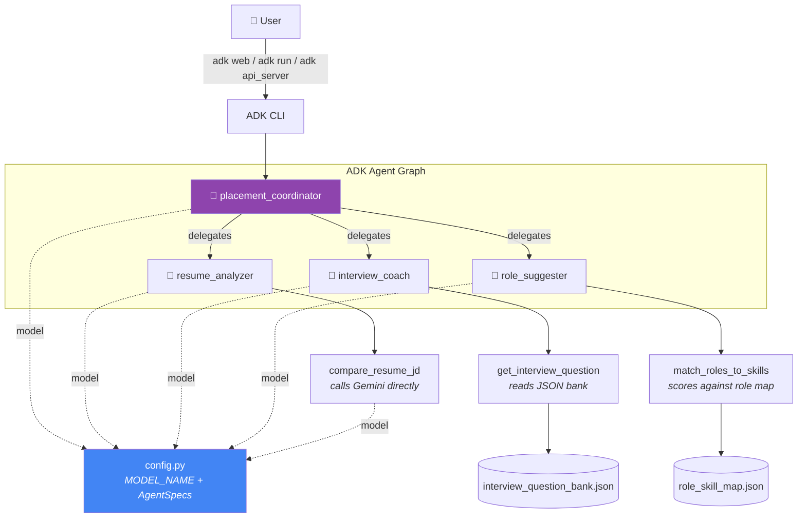

<div align="center">

# 🎓 Placement Agent

**A 4-agent career-prep system built on Google's Agent Development Kit (ADK)**

Built for the **GDG Nashik × Deboistech — "From Prompt to Prod"** workshop


</div>

---

## Table of Contents

- [Overview](#overview)
- [Why ADK's Own Interface](#why-adks-own-interface)
- [Architecture](#architecture)
- [Project Structure](#project-structure)
- [Prerequisites](#prerequisites)
- [Setup](#setup)
- [Configuration](#configuration)
- [Running the Project](#running-the-project)
- [The Agents](#the-agents)
- [The Tools](#the-tools)
- [Data Files](#data-files)
- [Deploy to GCP (Vertex AI Agent Engine)](#deploy-to-gcp-vertex-ai-agent-engine)
- [Troubleshooting](#troubleshooting)
- [Workshop Guide: Reading the Code Block by Block](#workshop-guide-reading-the-code-block-by-block)
- [Credits](#credits)

---

## Overview

**Placement Agent** helps a candidate prepare for job placements through three specialist AI agents, all routed by one coordinator:

| Agent | What it does |
|---|---|
| 🧭 **Coordinator** | Reads the user's intent and hands off to the right specialist |
| 📄 **Resume Analyzer** | Compares a resume against a job description; surfaces skill gaps |
| 🎤 **Interview Coach** | Runs a mock interview, one question at a time, with scored feedback |
| 🎯 **Role Suggester** | Recommends the best-fit job roles for a candidate's skill set |

It's a teaching project: every agent follows the exact same file shape, so once you understand one, you can predict the other two before opening them.

---

## Why ADK's Own Interface

This project deliberately ships **no custom CLI and no custom web UI**. The point of the workshop is ADK itself — its dev console, its runner, its session/event model — not a bespoke product wrapped around it. Everything here is run and inspected through ADK's own tooling:

```bash
adk web .          # chat UI + event/trace inspector + agent-graph view
adk run .           # terminal chat, no browser needed
adk api_server .    # the same agent graph exposed as a REST API
```

If you're evaluating ADK, this is what "using ADK" actually looks like with nothing hand-built in front of it.

---

## Architecture



Every agent, and the resume-comparison tool, pulls its model name from **one place** (`config.py`) — nothing else in the codebase hardcodes a model string.

---

## Project Structure

```
google-adk-project/
├── agent.py                          # Entry point ADK's own tooling scans (`adk web`, `adk run`, `adk api_server`)
├── placement_agent/
│   ├── config.py                     # 🔑 Single source of truth: model name + agent specs
│   ├── coordinator.py                # Multi-agent router (the `root_agent`)
│   ├── agents/
│   │   ├── resume_analyzer.py
│   │   ├── interview_coach.py
│   │   └── role_suggester.py
│   ├── tools/
│   │   ├── compare_resume_jd.py      # Calls Gemini directly for structured JSON extraction
│   │   ├── match_roles.py            # Pure-Python scoring, no LLM call
│   │   ├── interview_questions.py    # Pure-Python JSON lookup, no LLM call
│   │   └── resume_parser.py          # PDF/DOCX/TXT → plain text (paste the result into the chat)
│   └── data/
│       ├── role_skill_map.json       # 10 roles × required/preferred skills
│       └── interview_question_bank.json  # 6 categories × question sets
├── deploy/                           # Vertex AI Agent Engine deploy/query/delete scripts
├── logs/                             # ADK dev-server logs (gitignored)
├── .env                              # Your secrets — never committed
└── .env.example                      # Template showing required variables
```

---

## Prerequisites

- **Python 3.11+**
- A **Google AI Studio API key** — free at [aistudio.google.com/apikey](https://aistudio.google.com/apikey)
- [`uv`](https://github.com/astral-sh/uv) (recommended) or plain `pip`

---

## Setup

**1. Create and activate a virtual environment**

```bash
uv venv
source .venv/bin/activate
```

**2. Install dependencies**

```bash
uv pip install google-adk google-genai python-dotenv pypdf python-docx
```

<details>
<summary>Exact versions this project was built and tested against</summary>

| Package | Version | Used for |
|---|---|---|
| `google-adk` | 2.8.0 | Agents, coordinator, runner, dev UI/CLI/API server |
| `google-genai` | 2.22.0 | Direct Gemini calls (`compare_resume_jd`) |
| `python-dotenv` | 1.2.3 | Loading `.env` |
| `pypdf` | 6.17.0 | Resume PDF text extraction |
| `python-docx` | 1.2.0 | Resume DOCX text extraction |

</details>

**3. Configure your API key**

```bash
cp .env.example .env
```

Open `.env` and paste your key:

```dotenv
GOOGLE_API_KEY="AIza..."
GOOGLE_GENAI_USE_VERTEXAI=FALSE
```

**4. Verify the install**

```bash
python -c "from placement_agent.coordinator import root_agent; print(root_agent.name, 'OK')"
```

---

## Configuration

Everything model- and identity-related lives in **`placement_agent/config.py`** — this is the first file to read and the only file you should ever need to edit to change models.

```python
MODEL_NAME = "gemini-flash-lite-latest"

@dataclass(frozen=True)
class AgentSpec:
    name: str
    description: str
    model: str = MODEL_NAME
```

Each agent file imports its own `AgentSpec` (`COORDINATOR_SPEC`, `RESUME_ANALYZER_SPEC`, `INTERVIEW_COACH_SPEC`, `ROLE_SUGGESTER_SPEC`) instead of hardcoding `name` / `model` / `description` — so the whole system's identity is declared in one readable place.

### Why `gemini-flash-lite-latest`?

| Model tried | Result |
|---|---|
| `gemini-2.5-flash` | ❌ `404` — retired for new Google AI Studio accounts |
| `gemini-2.5-flash-lite` | ❌ `404` — same generation-wide retirement |
| `gemini-3.6-flash` (flagship) | ✅ Works, but free tier caps at **20 requests/day** — exhausted almost instantly during dev |
| `gemini-flash-lite-latest` | ✅ Works, and free-tier lite-model quota is meaningfully higher |

`gemini-flash-lite-latest` is a Google-maintained alias that always points at the current lite model, so a future model retirement (like the one above) won't silently 404 this project again.

---

## Running the Project

Everything runs through ADK's own CLI, pointed at the project root (where `agent.py` lives).

### `adk web .` — dev console (recommended)

```bash
adk web --port 8001 .
```

Open **http://127.0.0.1:8001**. Google's own development console: chat, an event/trace inspector, a session-state viewer, and an agent-graph view showing exactly how the coordinator routes to each specialist.

### `adk run .` — terminal chat

```bash
adk run .
```

A plain terminal conversation against `root_agent`, no browser needed.

### `adk api_server .` — REST API

```bash
adk api_server --port 8000 .
```

Exposes the same agent graph as a REST API (session creation + `/run`/`/run_sse` endpoints) — useful if you want to script against it or wire up your own frontend later, without touching any agent code.

> All three commands run the exact same `root_agent` defined in `agent.py`. Run more than one at once if you like, on different ports — they don't conflict.

---

## The Agents

| Agent | File | Model | Tool(s) used |
|---|---|---|---|
| 🧭 `placement_coordinator` | `coordinator.py` | `gemini-flash-lite-latest` | *(delegates only — no tools of its own)* |
| 📄 `resume_analyzer` | `agents/resume_analyzer.py` | `gemini-flash-lite-latest` | `compare_resume_jd` |
| 🎤 `interview_coach` | `agents/interview_coach.py` | `gemini-flash-lite-latest` | `get_interview_question` |
| 🎯 `role_suggester` | `agents/role_suggester.py` | `gemini-flash-lite-latest` | `match_roles_to_skills` |

The coordinator's instruction explicitly forbids it from analyzing resumes, running interviews, or suggesting roles itself — its only job is to route.

---

## The Tools

| Tool | Type | What it does |
|---|---|---|
| `compare_resume_jd(resume_text, jd_text)` | LLM call | Prompts Gemini directly (via `google.genai`, outside the ADK agent loop) to extract and diff skills, returning structured JSON: match strength, overlapping/missing skills, verdict |
| `match_roles_to_skills(skills)` | Pure Python | Scores candidate skills against `role_skill_map.json` (70% weight required skills, 30% preferred), returns top 3 roles with gaps |
| `get_interview_question(role_category, question_index)` | Pure Python | Steps through `interview_question_bank.json` one question at a time; reports `is_complete: true` once the bank is exhausted |
| `extract_resume_text(data, filename)` | Pure Python (not agent-callable) | Turns a PDF/DOCX/TXT resume file on disk into plain text; run it yourself and paste the result into the chat — see below |

Three of the four are pure Python with **no LLM call and no API cost** — a deliberate teaching point: not every "AI agent" action needs to hit the model.

### Resume parsing (`tools/resume_parser.py`)

Real resumes show up as PDF (LinkedIn/Canva/Google Docs exports) or DOCX almost exclusively — pasting plain text is the exception, not the norm. `extract_resume_text()` handles that market reality, but it is intentionally **not** registered as an ADK tool: the LLM never decides to call it, and there's no upload widget in ADK's dev UI. To use it, run it yourself before chatting:

```bash
python -c "
from placement_agent.tools.resume_parser import extract_resume_text
with open('resume.pdf', 'rb') as f:
    print(extract_resume_text(f.read(), 'resume.pdf'))
"
```

Paste the printed text into the `resume_analyzer` chat in `adk web` / `adk run`, exactly like a pasted resume would be sent.

| Format | Library | Notes |
|---|---|---|
| `.pdf` | `pypdf` | Best-effort text extraction; a scanned image with no text layer will raise a clear error asking you to paste text instead |
| `.docx` | `python-docx` | Reads paragraph text in document order |
| `.txt` / `.md` | built-in | Decoded directly |

Extracted text is whitespace-normalized (stripped, blank lines collapsed) before being handed off. Files are capped at **5 MB**; unsupported extensions and empty extraction results both fail with a specific, user-facing message rather than a stack trace.

---

## Data Files

<details>
<summary><b>role_skill_map.json</b> — 10 roles, each with required + preferred skills</summary>

```json
{
  "Software Development Engineer (SDE)": {
    "required": ["Python", "Java", "C++", "Data Structures", "Algorithms", "Git", "REST APIs", "SQL"],
    "preferred": ["System Design", "Kubernetes", "Docker", "AWS", "Go", "TypeScript", "Microservices", "CI/CD"]
  }
}
```

Full role list: SDE, Frontend Engineer, Backend Engineer, Data Engineer, ML Engineer, Data Scientist, DevOps/SRE, Product Manager, AI/LLM Engineer, Cloud/Solutions Architect.

</details>

<details>
<summary><b>interview_question_bank.json</b> — 6 categories of interview questions</summary>

| Category key | Label | Questions |
|---|---|---|
| `sde` | Software Development Engineer | 7 |
| `data` | Data Engineer / Data Scientist | 6 |
| `ml` | Machine Learning / AI Engineer | 5 |
| `devops` | DevOps / SRE / Cloud Engineer | 5 |
| `pm` | Product Manager | 5 |
| `general` | General / Freshers | 5 |

Each question includes hints and `good_answer_keywords` used to guide the coach's feedback.

</details>

---

## Deploy to GCP (Vertex AI Agent Engine)

`adk web` / `adk run` / `adk api_server` above all run the agents **locally** against Google AI Studio (or Vertex AI directly, if you switch `GOOGLE_GENAI_USE_VERTEXAI`). This section adds a separate, optional path: deploying the same `placement_coordinator` agent graph to **Vertex AI Agent Engine**, Google's managed, serverless runtime for ADK agents — no servers to run, scales to zero when idle.

### Prerequisites

- A GCP project with **billing enabled**
- The Vertex AI API enabled: `gcloud services enable aiplatform.googleapis.com`
- Application Default Credentials: `gcloud auth application-default login`
- A Cloud Storage bucket in the same project/region, for staging the deployment package:
  ```bash
  gcloud storage buckets create gs://YOUR_BUCKET_NAME --location=us-central1
  ```

### Setup

```bash
uv pip install "google-cloud-aiplatform[adk,agent_engines]"
```

In `.env`, set:

```dotenv
GOOGLE_GENAI_USE_VERTEXAI=TRUE
GOOGLE_CLOUD_PROJECT="your-project-id"
GOOGLE_CLOUD_LOCATION="us-central1"
GOOGLE_CLOUD_STAGING_BUCKET="your-bucket-name"
```

### Deploy

```bash
python deploy/deploy_agent_engine.py
```

This packages `placement_agent/` and provisions a managed `reasoningEngine` (usually a few minutes). On success it prints a resource name — paste it into `.env` as `AGENT_ENGINE_RESOURCE_NAME`.

### Test the deployment

```bash
python deploy/query_agent_engine.py
```

A terminal chat against the *deployed* agent (not your local one) — confirms the remote deployment actually answers.

### Delete it when you're done

```bash
python deploy/delete_agent_engine.py
```

**Agent Engine bills for the underlying model calls and a small management overhead even though it scales to zero when idle — it is not free just because nothing is actively serving.** Delete the resource after testing rather than leaving it deployed indefinitely.

---

## Troubleshooting

<details>
<summary><b>Error: <code>GOOGLE_API_KEY environment variable is not set</code></b></summary>

You haven't created `.env`, or it's empty. Run `cp .env.example .env` and paste your key from [aistudio.google.com/apikey](https://aistudio.google.com/apikey).

</details>

<details>
<summary><b>Error: <code>404 NOT_FOUND ... no longer available to new users</code></b></summary>

You changed `MODEL_NAME` to a retired model (e.g. `gemini-2.5-flash`). This is a Google account-level block, not a bug — no code change fixes it. Set `MODEL_NAME` back to `gemini-flash-lite-latest` in `config.py`.

</details>

<details>
<summary><b>Error: <code>429 RESOURCE_EXHAUSTED ... generate_content_free_tier_requests</code></b></summary>

You've hit the free-tier daily request cap for the model. Options:
1. Wait for the quota to reset (resets at midnight Pacific time)
2. Enable billing on your AI Studio project for higher limits
3. Keep `MODEL_NAME` on a lite model, which has a higher free-tier ceiling than flagship models

</details>

<details>
<summary><b><code>adk</code>: command not found</b></summary>

The `adk` CLI ships with the `google-adk` package and lands on your `PATH` once your virtualenv is activated (`source .venv/bin/activate`). If it's still missing, reinstall with `uv pip install google-adk` inside the active venv.

</details>

<details>
<summary><b>IDE shows "Cannot find module google.adk.agents"</b></summary>

Your editor's language server is pointed at a different Python interpreter than this project's `.venv`. Point your IDE's interpreter at `.venv/bin/python` — it doesn't affect actually running the project.

</details>

---

## Workshop Guide: Reading the Code Block by Block

Recommended teaching order — each block builds on the last, and each is small enough to explain in one sitting:

| Block | File(s) | Concept taught |
|---|---|---|
| **1** | `config.py` | Centralized configuration — one model name, one spec per agent |
| **2** | `tools/match_roles.py`, `tools/interview_questions.py` | A "tool" can be plain Python — no LLM call required |
| **3** | `tools/compare_resume_jd.py` | A tool *can* call an LLM directly, outside the agent loop, for structured extraction |
| **4** | `agents/resume_analyzer.py` | Anatomy of one ADK `Agent`: name, model, description, instruction, tools |
| **5** | `agents/interview_coach.py`, `agents/role_suggester.py` | The same pattern repeats — once you've read one agent file, you can predict the rest |
| **6** | `coordinator.py` | Multi-agent routing via `sub_agents` — a coordinator that delegates instead of acting |
| **7** | `agent.py` | The single `root_agent` export ADK's own CLI (`adk web`/`adk run`/`adk api_server`) scans for — this is the entire integration surface |
| **8** | `tools/resume_parser.py` | Not everything that touches a file is an agent tool — this runs *outside* the agent, before the LLM ever sees the text |

By block 5, students should be able to write a **new** specialist agent (e.g. a "Salary Negotiator") without being shown how — that's the test of whether the modularity is doing its job.

---

## Credits

Built for **GDG Nashik × Deboistech — "From Prompt to Prod"** workshop.

Powered by [Google Agent Development Kit (ADK)](https://google.github.io/adk-docs/) and the Gemini API.
